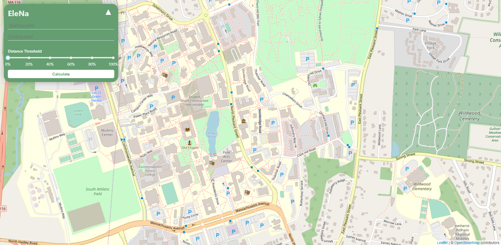
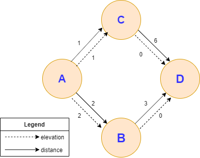

# EleNa Project

Most standard navigation applications are looking to provide you with a shortest distance path or a shortest time path. What we've done here is provide a functioning navigation application which returns a path in which we are looking to minimize elevation gain within a certain threshold. This can be useful for a variety of applications, specifically hiking and/or biking. We decided to lower our scale and focus on Amherst, Massachusetts. Our focus is on walking/hiking and we have made our application mobile-friendly. 

## How to run the application locally
Requirements: Docker Desktop
* [Docker Desktop](https://www.docker.com/products/docker-desktop)

We've set up our project within a Docker container. Running this locally will require the user of Docker.

Note that for use with this project, it's recommended to not (extremely) limit the resources available to Docker due to resource-heavy computations. To change this setting, go to 'Settings' within Docker and adjust the 'CPUs' and 'Memory' appropriately. 

Run Docker. After cloning the respository, run the following command from the project directory:

```
docker-compose up
```
Once it finishes building and runs services, visit: 
```
localhost:3050
```

You should now have a running application similar to that pictured below:<br><br>



## How to Update the Docker Images 

If changes are made or pulled, Docker will have to rebuild the image in order to apply these changes. 
In this case, run the following command:

```
docker-compose up --build
```

## How It Works

We utilize OSMnx to build our map model, which in turn utilizes OpenStreetMap. Elevation values are not provided initially, but are seamlessly added through use of OSMnx and Google's Elevation API. From this, we've created a full mapping of the walkable paths available throughout Amherst, MA. 

The frontend sends a request to the backend that includes the latitude and longitude of both the "Start Location" and "Destination Location", in addition to a "Threshold" value which represents how far the user wants to travel beyond the shortest path between these two locations. From this, the backend will find the closest node in our model to these two values.  

A model object is created created in `backend/algorithm/model.py`


We utilize OSMnx to build our map model and add elevation to the nodes present within the map. We've built a full model of Amherst, Massachusetts. 

This is for you guys to understand the backend flow 

1. Frontend send the request 
2. The request will heat `backend/algorithm/views.py`
3. Create the model object from `backend/algorithm/model.py`
4. Create the navigator object from `backend/algorithm/algorithm.py`
5. Run the algorithm ad get the result from `my_navigator.get_the_path()`
6. Send the result to the frontend

## Testing

### FrontEnd Testing
Our frontend testing relates primarily to user input and to ensure that the page is displaying properly. 
#### Tests
Assertions: 
- The frontend input textboxes pertaining to the "Start Location" and "Destination Location" changes are properly reflected and hold user input. 
- Visiting a page returns a 200-level response. 
- Map component is visible upon loading a page.

### BackEnd Testing
Our backend testing is substantial as it is of utmost importance to ensuring the success of our application. 

We first test to ensure that our algorithm is working correctly. This is done in `backend\algorithm\tests.py`.

Assertions:<br>
A test model was created to imitate the real model. This model is controlled and the expected values are well-known. 
- Threshhold 2.0 or 200%
    - Shortest Path: A -> B -> D
        - Distance Traveled: 5
        - Elevation Gain: 1

    - Minimized Elevation: A -> C -> D
        - Distance Traveled: 7
        - Elevation Gain: 1
- Threshold 1.0 or 100%
    - Shortest Path: A -> B -> D
    - Minimized Elevation: A -> B -> D
        - Distance Traveled: 5
        - Elevation Gain: 2

Imitation Model:<br>    


The results were as expected above. 

We have multiple cases for testing, including: 
- `test_shortest_path_no_threshold`
- `test_best_elevation_no_threshold`
- `test_shortest_path_yes_threshold`
- `test_best_elevation_yes_threshold`

The tests are relatively self-explanatory. We are testing for shortest path and best elevation, both with and without a threshold. 
Note that for use with this project, it's recommended to not limit 
Run Docker. After cloning the respository, run the following command from the project directory:

----------------------

Beyond our algorithms, we must also test our Model class. This provides our application with access to OpenStreetMap data. 

In our test object, we've initiated known points **Sylvan Brown Hall** and **Worcester Dining** located in Amherst, MA. 

`test_get_edge_length`<br>
Compares the edge length in our test object against a known, valid edge in our Map.<br>
`test_get_neighbors`<br>
Compares neighboring nodes of a node in the test object against the known, valid neighboring nodes from a node in our Map.<br>
`test_get_elevation`<br>
Compares elevation value in our test object against a known, valid elevation value in our Map. 

## Limitations
Limitations:
- Searchable area is limited to Amherst, MA. 
- The model we are using is a network of walkable paths. 
- Display shortest path and path with minimized elevation.
- Timeout error if response time is too long - this can be minimized by providing Docker with more resources as mentioned above.

## Future Plans
- Extend our searchable area.
- Add ability to show path with maximum elevation. 

## Built With

* [React](https://reactjs.org/) - Javascript Frontend framework
* [Django](https://www.djangoproject.com) - Python Web framework


## Authors

* **Geon Yoon** - *Backend and DevOps* - [Geon Yoon](https://github.com/GeonYoon)
* **Jackson Weber** - *Frontend* - [Jackson Weber](https://github.com/JacksonWeber)
* **Adam Tiago** - *API research and testing* - [Adam Tiago](https://github.com/tiagosaurus)
* **Kevin Tu** - *API research and testing* - [Kevin Tu](https://github.com/kevTu)
